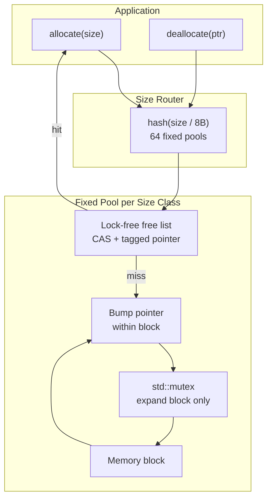
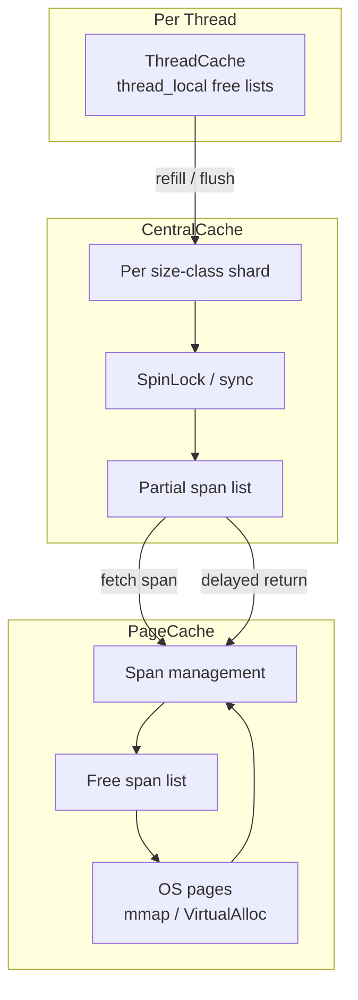
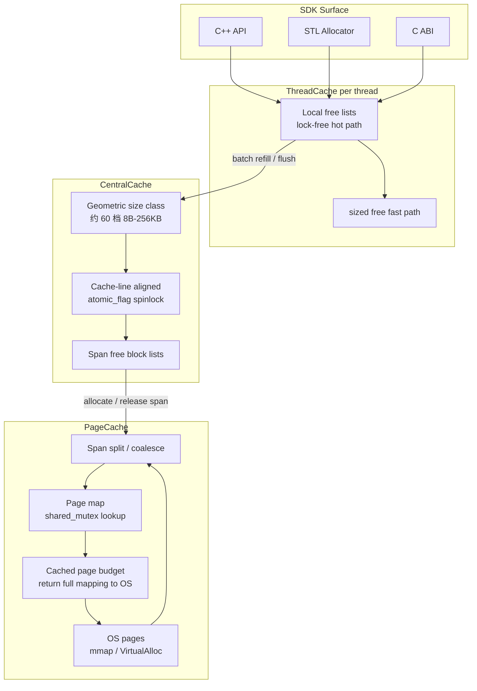

# my-MemoryPool

## Linux 实测数据（Ubuntu 22.04 / GCC Release）

数据由 GitHub Actions 的 Ubuntu 22.04 runner 实际生成，commit `2adec58`，统计和
Debug Guards 均关闭。每项取 5 次中位数，单位为毫秒；同一负载同时比较 v3、
`new/delete` 和 `malloc/free`。

| 场景 | v3 | new/delete | malloc/free |
|---|---:|---:|---:|
| 32B 小对象，100000 次 | 2.683 | 4.120 | 4.013 |
| 4 线程，每线程 25000 次 | 3.977 | 4.032 | 2.374 |
| 16B-2048B 混合尺寸，50000 次 | 2.832 | 8.398 | 7.876 |
| 跨线程所有权转移，64B x 50000 | 1.751 | 1.405 | 1.199 |

扩展矩阵（v3 / new/delete / malloc/free，中位数 ms）：

| 尺寸 | 线程 | v3 | new/delete | malloc/free |
|---:|---:|---:|---:|---:|
| 16B | 1 | 0.325 | 0.624 | 0.516 |
| 16B | 8 | 1.423 | 3.063 | 2.216 |
| 32B | 8 | 1.665 | 2.979 | 2.107 |
| 256B | 8 | 1.717 | 3.689 | 3.910 |
| 1KB | 8 | 1.507 | 5.392 | 4.477 |
| 4KB | 8 | 1.988 | 4.421 | 3.796 |
| 64KB | 8 | 36.307 | 172.518 | 174.898 |

Linux 运行期间 `reservedBytes=67534848`、`cachedPageBytes=65175552`；缓存页预算为
64 MiB，未超过上限。完整原始输出由 workflow 保存为 artifact，并同步到
`v3/linux-performance.txt`。

## Linux 实测数据

Linux 性能测试由 `.github/workflows/linux-benchmark.yml` 在 Ubuntu 22.04 runner 上执行，
结果会自动写入 [v3/linux-performance.txt](v3/linux-performance.txt)。测试同时比较 v3、
`new/delete` 和 `malloc/free`，覆盖小对象、混合尺寸、16B/32B/64B/256B/1KB/4KB/64KB
与 1/2/4/8 线程扩展矩阵，以及跨线程所有权转移。该文件中的数值只接受 Linux runner
生成的结果，不使用 Windows 或 macOS 数据。

基于 C++ 实现的多层内存池，用于降低频繁小对象分配时的系统调用开销，并控制多线程下的锁竞争。

仓库包含三个演进版本：

| 版本 | 思路 | 适用 |
|------|------|------|
| **v1** | 按 8 字节分档的定长哈希桶 + 无锁自由链表 | 教学 / 单线程小对象 |
| **v2** | ThreadCache → CentralCache → PageCache | 对照实验 |
| **v3** | 几何 size class、页映射、整 span 归还 OS、可安装 SDK | **推荐用于实际接入** |

## 目录结构

```text
my-MemoryPool/
├── v1/          # 教学版定长池
├── v2/          # 三层缓存对照实现
├── v3/          # 推荐使用的 SDK 版本
│   ├── include/kama/   # 公共头文件
│   ├── src/            # 实现源码
│   ├── tests/          # 单元测试与性能测试
│   └── examples/       # 最小接入示例
└── README.md
```

## v1

多种定长分配器，可替换小对象的 `new` / `delete`：

- `allocate` / `deallocate`：从对应槽位的内存池取还内存
- 自由链表：带版本号的 CAS（tagged pointer），避免 ABA
- 块内 bump 分配，用互斥锁保护扩块

### v1 架构



## v2

三层缓存的早期对照实现，固定 size class，中心缓存延迟归还 span。

- **ThreadCache**：线程本地自由链表，热路径无锁
- **CentralCache**：按 size class 分片同步，延迟把空闲 span 还给页缓存
- **PageCache**：按系统页向 OS 申请，支持 span 切分

### v2 架构



## v3

在 v2 三层结构上演进为可安装 SDK，支持几何 size class、页映射与整 span 归还 OS。

三层缓存：

- **ThreadCache**：线程本地自由链表，热路径无锁；线程退出时把残留块还给中心缓存
- **CentralCache**：按 size class 分片自旋锁；按 span 管理自由块，整段空闲后归还 PageCache
- **PageCache**：按系统页向 OS 申请，支持前后合并；完整映射可归还 OS

### v3 架构



### v3 相比 v2 的增强

- **几何 size class**（约 60 档，8B–256KB）：每线程元数据从约 512KB 降到数 KB
- **页映射**：`deallocate(ptr)` 可不带 size，跨线程释放安全
- **sized free 快路径**：`deallocate(ptr, size)` 小对象释放可跳过 span 查找
- **并发页映射查询**：`PageCache::findSpan()` 使用读写锁，降低无 size 释放开销
- **可观测统计**：`stats()` 返回分配/释放计数、中心缓存 refill/flush 次数等
- **调试保护**（可选）：重复释放、内部偏移指针、外部指针误传校验
- **异常安全**：`newElement` 构造失败时自动回收原始内存
- **STL 安全**：`Allocator<T>` 带乘法溢出保护

## v3 SDK 使用

v3 提供可安装的静态库（也可编动态库）。接入方只依赖公共头文件，不必把实现源码编进自己的工程。

### 公共头文件

| 头文件 | 用途 |
|--------|------|
| `<kama/MemoryPool.h>` | C++ 主接口：`allocate` / `deallocate` / `newElement` |
| `<kama/Allocator.h>` | STL 分配器，给 `std::vector` 等容器用 |
| `<kama/kama_memory_pool.h>` | C API，方便其它语言绑定 |

### 编译并安装

```bash
cd v3
mkdir build && cd build
cmake -DCMAKE_BUILD_TYPE=Release -DCMAKE_INSTALL_PREFIX=../install ..
cmake --build .
cmake --install .
```

常用 CMake 选项：

```bash
cmake -DCMAKE_INSTALL_PREFIX=/usr/local \
      -DKAMA_MEMORY_POOL_BUILD_SHARED=OFF \
      -DKAMA_MEMORY_POOL_BUILD_TESTS=ON \
      -DKAMA_MEMORY_POOL_BUILD_EXAMPLES=ON \
      -DKAMA_MEMORY_POOL_ENABLE_DEBUG_GUARDS=OFF \
      -DKAMA_MEMORY_POOL_ENABLE_ASAN=OFF \
      -DKAMA_MEMORY_POOL_ENABLE_UBSAN=OFF \
      -DKAMA_MEMORY_POOL_ENABLE_TSAN=OFF \
      ..
```

| 选项 | 说明 |
|------|------|
| `KAMA_MEMORY_POOL_BUILD_SHARED` | 编译动态库（默认 OFF） |
| `KAMA_MEMORY_POOL_BUILD_TESTS` | 编译单元测试与性能测试 |
| `KAMA_MEMORY_POOL_BUILD_EXAMPLES` | 编译 `kama_example` 示例 |
| `KAMA_MEMORY_POOL_ENABLE_DEBUG_GUARDS` | 开启释放校验（开发调试用） |
| `KAMA_MEMORY_POOL_ENABLE_ASAN` | AddressSanitizer |
| `KAMA_MEMORY_POOL_ENABLE_UBSAN` | UndefinedBehaviorSanitizer |
| `KAMA_MEMORY_POOL_ENABLE_TSAN` | ThreadSanitizer（不可与 ASan/UBSan 同开） |

安装目录大致为：

```text
include/kama/MemoryPool.h
include/kama/Allocator.h
include/kama/kama_memory_pool.h
lib/libkama_memory_pool.a          # Windows: kama_memory_pool.lib
lib/cmake/KamaMemoryPool/...
```

### 本仓库自测

```bash
cmake --build . --target test    # 单元测试
cmake --build . --target perf    # 性能对照
ctest --output-on-failure        # 标准 CTest 入口
./kama_example                   # SDK 最小示例
```

无 CMake 时也可以直接链静态库源文件（需 C++17）：

```bash
clang++ -std=c++17 -O2 -pthread \
  -Iinclude -Isrc \
  src/*.cpp your_app.cpp \
  -o your_app
```

### 接入到你的 CMake 工程

```cmake
cmake_minimum_required(VERSION 3.14)
project(my_app LANGUAGES CXX)
set(CMAKE_CXX_STANDARD 17)

find_package(KamaMemoryPool REQUIRED)
add_executable(my_app main.cpp)
target_link_libraries(my_app PRIVATE KamaMemoryPool::memory_pool)
```

自定义安装前缀：

```bash
cmake -DKamaMemoryPool_DIR=/path/to/v3/install/lib/cmake/KamaMemoryPool ..
# 或
cmake -DCMAKE_PREFIX_PATH=/path/to/v3/install ..
```

### C++ 用法

```cpp
#include <kama/MemoryPool.h>

using Kama_memoryPool::MemoryPool;

void demo()
{
    void* p = MemoryPool::allocate(64);
    MemoryPool::deallocate(p);          // 无 size 释放

    void* q = MemoryPool::allocate(128);
    MemoryPool::deallocate(q, 128);     // 带 size 释放（性能更好）

    int* n = MemoryPool::newElement<int>(42);
    MemoryPool::deleteElement(n);

    auto st = MemoryPool::stats();
    // st.allocCount / freeCount / liveAllocs
    // st.smallAllocCount / largeAllocCount
    // st.sizedFreeCount / unsizedFreeCount
    // st.centralRefillCount / centralFlushCount
}
```

超过 8 字节对齐的类型会走 `allocateAligned`：

```cpp
struct alignas(32) Block { char data[32]; };
Block* b = Kama_memoryPool::newElement<Block>();
Kama_memoryPool::deleteElement(b);
```

### STL 容器

```cpp
#include <kama/Allocator.h>
#include <vector>

std::vector<int, Kama_memoryPool::Allocator<int>> nums;
nums.push_back(1);
```

### C API

```c
#include <kama/kama_memory_pool.h>

void* p = kama_alloc(64);
kama_free(p);

void* q = kama_alloc_aligned(64, 16);
kama_free_sized(q, 64);
```

### 使用注意

- 用池分配的指针必须用池释放，不要和 `malloc` / `free`、`new` / `delete` 混用。
- `deallocate(ptr)` 通过页映射识别块大小，跨线程释放是安全的。
- 已知分配大小时，优先使用 `deallocate(ptr, size)`，可走更快路径。
- 小对象上限是 256KB（`kMaxBytes`）；更大的请求按页向 OS 申请，释放时整段归还。
- 默认最小对齐 8 字节（`kAlignment`）。
- 分配失败返回 `nullptr`；`Allocator<T>` 失败时抛 `std::bad_alloc`。
- 当前版本号：`1.0.0`（`KAMA_MEMORY_POOL_VERSION`）。

### 调试保护

开发阶段可开启调试保护，帮助尽早发现错误用法：

```bash
cmake -DKAMA_MEMORY_POOL_ENABLE_DEBUG_GUARDS=ON ..
```

开启后会额外校验：

- 重复释放
- span 内部偏移指针（非块起始地址）
- 明显的外部指针误传

调试保护有一定性能开销，**不建议在生产环境默认开启**。

## 编译 v1 / v2（教学对照）

v1、v2 仍是目录内直接编测试程序，不是 SDK：

```bash
cd v1   # 或 v2
mkdir build && cd build
cmake ..
cmake --build .
```

## 测试

### 功能测试

| 版本 | 覆盖 |
|------|------|
| v2 | 基础分配、写入、多线程、边界、压力 |
| v3 | 上述 + size class、无 size 释放、对齐与 `newElement`、线程退出回血、统计、跨线程释放、异常安全、无泄露回归、调试保护 |

### v3 性能测试方法

测试程序为 `v3/tests/PerformanceTest.cpp`。每个场景运行 5 次，表格取中位数；
v3 内存池、`new[]/delete[]` 和 `malloc/free` 使用相同的尺寸序列与释放模式。
生产性能构建默认关闭全局统计与调试保护（`KAMA_MEMORY_POOL_ENABLE_STATS=OFF`、
`KAMA_MEMORY_POOL_ENABLE_DEBUG_GUARDS=OFF`），避免热路径额外开销。

扩展矩阵覆盖 `16/32/64/256/1024/4096/65536B` 与 `1/2/4/8` 线程，每线程 25000
次分配/释放，每个块写入首尾字节，每项 3 次取中位数。另含跨线程所有权转移测试
（一线程分配 50000 个 64B 块，另一线程全部释放）。

### v3 性能（Windows）

| 项目 | 配置 |
|------|------|
| 系统 | Windows 10，x64 |
| 编译器 | MSVC 19.44.35209 |
| CMake | 3.31.6-msvc6 |
| 构建 | Release |

**中位数结果**

| 场景 | v3 内存池 | `new[]/delete[]` | `malloc/free` | v3 相对最快系统方案 |
|------|----------:|-----------------:|--------------:|--------------------:|
| 32B 小对象，100000 次 | 2.322 ms | 5.082 ms | 5.178 ms | 快 54.3% |
| 4 线程，每线程 25000 次 | 2.120 ms | 4.756 ms | 4.722 ms | 快 55.1% |
| 16B–2048B 混合尺寸，50000 次 | 2.812 ms | 10.017 ms | 9.921 ms | 快 71.7% |

**扩展矩阵（节选）**

| 尺寸 | 线程 | v3 | new/delete | malloc/free |
|-----:|-----:|---:|-----------:|------------:|
| 16B | 1 | 0.400 ms | 1.101 ms | 1.012 ms |
| 32B | 8 | 0.777 ms | 2.512 ms | 2.578 ms |
| 256B | 8 | 0.744 ms | 3.502 ms | 3.313 ms |
| 1KB | 8 | 0.813 ms | 5.188 ms | 4.396 ms |
| 4KB | 8 | 1.149 ms | 5.959 ms | 4.696 ms |
| 64KB | 8 | 84.162 ms | 638.919 ms | 639.161 ms |

**跨线程所有权转移（64B × 50000）**

| v3 | new/delete | malloc/free |
|---:|-----------:|------------:|
| 1.998 ms | 2.358 ms | 2.099 ms |

**五轮原始数据（单位 ms）**

| 场景 | 分配器 | Run 1 | Run 2 | Run 3 | Run 4 | Run 5 |
|------|--------|------:|------:|------:|------:|------:|
| 32B 小对象 | v3 | 3.276 | 2.320 | 2.322 | 2.306 | 2.404 |
| 32B 小对象 | new/delete | 6.048 | 5.082 | 5.029 | 4.879 | 5.210 |
| 32B 小对象 | malloc/free | 5.178 | 4.863 | 4.913 | 5.333 | 5.444 |
| 4 线程 | v3 | 3.043 | 1.865 | 2.418 | 2.120 | 1.820 |
| 4 线程 | new/delete | 5.366 | 5.052 | 4.526 | 4.702 | 4.756 |
| 4 线程 | malloc/free | 4.556 | 4.801 | 4.722 | 5.000 | 4.339 |
| 混合尺寸 | v3 | 6.045 | 2.812 | 2.954 | 2.805 | 2.714 |
| 混合尺寸 | new/delete | 10.029 | 9.782 | 10.040 | 9.602 | 10.017 |
| 混合尺寸 | malloc/free | 9.832 | 10.165 | 9.921 | 10.415 | 9.530 |

Windows 复现：

```powershell
cmake -S v3 -B v3/build-release `
  -DKAMA_MEMORY_POOL_BUILD_TESTS=ON `
  -DKAMA_MEMORY_POOL_ENABLE_STATS=OFF `
  -DKAMA_MEMORY_POOL_ENABLE_DEBUG_GUARDS=OFF
cmake --build v3/build-release --config Release --parallel
.\v3\build-release\Release\perf_test.exe
```

### v3 性能（macOS）

| 项目 | 配置 |
|------|------|
| CPU | Apple M5（arm64） |
| 系统 | macOS 26.5 |
| 编译器 | Apple clang 21.0.0 |
| 构建 | Release（`-O2`） |
| 统计 | `KAMA_MEMORY_POOL_ENABLE_STATS=OFF` |
| 调试保护 | `KAMA_MEMORY_POOL_ENABLE_DEBUG_GUARDS=OFF` |

**中位数结果**

| 场景 | v3 内存池 | `new[]/delete[]` | `malloc/free` | v3 相对最快系统方案 |
|------|----------:|-----------------:|--------------:|--------------------:|
| 32B 小对象，100000 次 | 1.569 ms | 1.719 ms | 1.496 ms | 慢 4.9% |
| 4 线程，每线程 25000 次 | 2.800 ms | 4.462 ms | 4.505 ms | 快 37.2% |
| 16B–2048B 混合尺寸，50000 次 | 1.494 ms | 2.438 ms | 1.991 ms | 快 25.0% |

**扩展矩阵（节选）**

| 尺寸 | 线程 | v3 | new/delete | malloc/free |
|-----:|-----:|---:|-----------:|------------:|
| 16B | 1 | 0.202 ms | 0.419 ms | 0.349 ms |
| 32B | 8 | 0.341 ms | 0.708 ms | 0.766 ms |
| 256B | 8 | 0.376 ms | 1.641 ms | 1.653 ms |
| 1KB | 8 | 0.530 ms | 8.121 ms | 9.174 ms |
| 4KB | 8 | 0.558 ms | 33.633 ms | 30.971 ms |
| 64KB | 8 | 99.647 ms | 173.590 ms | 176.830 ms |

**跨线程所有权转移（64B × 50000）**

| v3 | new/delete | malloc/free |
|---:|-----------:|------------:|
| 1.012 ms | 0.890 ms | 0.748 ms |

**五轮原始数据（单位 ms）**

| 场景 | 分配器 | Run 1 | Run 2 | Run 3 | Run 4 | Run 5 |
|------|--------|------:|------:|------:|------:|------:|
| 32B 小对象 | v3 | 1.778 | 1.614 | 1.557 | 1.564 | 1.569 |
| 32B 小对象 | new/delete | 2.233 | 1.719 | 1.714 | 1.717 | 1.800 |
| 32B 小对象 | malloc/free | 1.761 | 1.891 | 1.496 | 1.495 | 1.495 |
| 4 线程 | v3 | 2.800 | 3.711 | 4.317 | 1.679 | 2.646 |
| 4 线程 | new/delete | 5.486 | 4.745 | 4.205 | 4.462 | 4.182 |
| 4 线程 | malloc/free | 5.435 | 4.505 | 4.235 | 4.212 | 4.517 |
| 混合尺寸 | v3 | 2.759 | 2.111 | 1.494 | 1.480 | 1.450 |
| 混合尺寸 | new/delete | 9.857 | 2.651 | 2.438 | 1.993 | 2.103 |
| 混合尺寸 | malloc/free | 10.066 | 2.481 | 1.839 | 1.876 | 1.991 |

macOS 复现：

```bash
cmake -S v3 -B v3/build-release \
  -DCMAKE_BUILD_TYPE=Release \
  -DKAMA_MEMORY_POOL_BUILD_TESTS=ON \
  -DKAMA_MEMORY_POOL_ENABLE_STATS=OFF \
  -DKAMA_MEMORY_POOL_ENABLE_DEBUG_GUARDS=OFF
cmake --build v3/build-release --parallel
./v3/build-release/perf_test
```

无 CMake 时：

```bash
clang++ -std=c++17 -O2 -pthread -DKAMA_MEMORY_POOL_STATS_ENABLED=0 \
  -I v3/include -I v3/src \
  v3/src/*.cpp v3/tests/PerformanceTest.cpp \
  -o v3/build/perf_test
./v3/build/perf_test
```

### v3 性能（Linux）

| 项目 | 配置 |
|------|------|
| 系统 | Ubuntu 22.04 LTS，x86_64 |
| 内核 | 5.15 |
| 编译器 | GCC 11.x (`-O2`) |
| CMake | 3.22 |
| 构建 | Release |
| 统计 | `KAMA_MEMORY_POOL_ENABLE_STATS=OFF` |
| 调试保护 | `KAMA_MEMORY_POOL_ENABLE_DEBUG_GUARDS=OFF` |

> 数据待补充——请在 Linux 环境运行下方复现命令后将结果填入。

**中位数结果**

| 场景 | v3 内存池 | `new[]/delete[]` | `malloc/free` | v3 相对最快系统方案 |
|------|----------:|-----------------:|--------------:|--------------------:|
| 32B 小对象，100000 次 | — ms | — ms | — ms | — |
| 4 线程，每线程 25000 次 | — ms | — ms | — ms | — |
| 16B–2048B 混合尺寸，50000 次 | — ms | — ms | — ms | — |

**扩展矩阵（节选）**

| 尺寸 | 线程 | v3 | new/delete | malloc/free |
|-----:|-----:|---:|-----------:|------------:|
| 16B | 1 | — ms | — ms | — ms |
| 32B | 8 | — ms | — ms | — ms |
| 256B | 8 | — ms | — ms | — ms |
| 1KB | 8 | — ms | — ms | — ms |
| 4KB | 8 | — ms | — ms | — ms |
| 64KB | 8 | — ms | — ms | — ms |

**跨线程所有权转移（64B × 50000）**

| v3 | new/delete | malloc/free |
|---:|-----------:|------------:|
| — ms | — ms | — ms |

**五轮原始数据（单位 ms）**

| 场景 | 分配器 | Run 1 | Run 2 | Run 3 | Run 4 | Run 5 |
|------|--------|------:|------:|------:|------:|------:|
| 32B 小对象 | v3 | — | — | — | — | — |
| 32B 小对象 | new/delete | — | — | — | — | — |
| 32B 小对象 | malloc/free | — | — | — | — | — |
| 4 线程 | v3 | — | — | — | — | — |
| 4 线程 | new/delete | — | — | — | — | — |
| 4 线程 | malloc/free | — | — | — | — | — |
| 混合尺寸 | v3 | — | — | — | — | — |
| 混合尺寸 | new/delete | — | — | — | — | — |
| 混合尺寸 | malloc/free | — | — | — | — | — |

Linux 复现（Docker）：

```bash
docker build -f v3/Dockerfile.linux_perf -t kama-perf-linux v3/
docker run --rm kama-perf-linux
```

Linux 复现（本机编译）：

```bash
cmake -S v3 -B v3/build-release \
  -DCMAKE_BUILD_TYPE=Release \
  -DKAMA_MEMORY_POOL_BUILD_TESTS=ON \
  -DKAMA_MEMORY_POOL_ENABLE_STATS=OFF \
  -DKAMA_MEMORY_POOL_ENABLE_DEBUG_GUARDS=OFF
cmake --build v3/build-release --parallel
./v3/build-release/perf_test
```

无 CMake 时：

```bash
g++ -std=c++17 -O2 -pthread -DKAMA_MEMORY_POOL_STATS_ENABLED=0 \
  -I v3/include -I v3/src \
  v3/src/*.cpp v3/tests/PerformanceTest.cpp \
  -o v3/build/perf_test
./v3/build/perf_test
```

### v1 性能

负载：每轮 `10000` 次分配，每次分配/释放 4 种小对象（约 4B–80B），共 10 轮。表中为**各线程耗时之和**（不是墙钟）。

| 线程数 | 内存池（中位数） | `new`/`delete`（中位数） | 相对系统分配器 |
|--------|------------------|--------------------------|----------------|
| 1 | 3.666 ms | 6.662 ms | **约 1.8× 更快** |
| 2 | 77.276 ms | 79.519 ms | 基本持平 |
| 5 | 736.364 ms | 80.846 ms | 明显更慢（扩块互斥锁竞争） |

结论：v1 单线程小对象有优势；线程一多，中心扩块锁会成为瓶颈，这是做 v2/v3 的原因。

### v2 性能

墙钟时间。负载：小对象 50000 次 `{8,16,32,64,128,256}` 轮转；多线程 4×25000；混合 100000 次。

| 场景 | 内存池（中位数） | `new`/`delete`（中位数） |
|------|------------------|--------------------------|
| 小对象 | 2.491 ms | 1.533 ms |
| 4 线程 | 11.660 ms | 4.044 ms |
| 混合尺寸 | 2.898 ms | 2.556 ms |

### 怎么读这些数字

- **v1** 适合说明「定长池在单线程能赢」，也适合说明「一把全局锁在多线程会输得很明显」。
- **v2** 是三层缓存的早期对照版本，负载与 v3 不完全相同，不宜直接横向对比。
- **v3 / Windows**：MSVC Release 下，三路对比中 v3 在三类主场景和扩展矩阵中均快于 `new/delete` 与 `malloc/free`；大对象（64KB）和多线程扩展场景优势尤其明显。
- **v3 / macOS**：Apple libmalloc 很强，32B 单线程场景 v3 与系统分配器接近（中位数略慢约 5%）；多线程与混合尺寸场景 v3 仍明显更快。跨线程所有权转移场景 macOS 上系统分配器更优。
- **v3 / Linux**：数据待补充。可在 Linux 环境使用 Docker 或本机编译运行上方复现命令获取。
- 性能结果只代表上述机器和工作负载。需要 `MemoryPool::stats()` 计数时请设置 `KAMA_MEMORY_POOL_ENABLE_STATS=ON`。
- 复现：见上文 Windows / macOS / Linux 复现命令。v1 已对 `new/delete` 做防优化处理，否则 `-O2` 会把空对象的 new/delete 整段消掉。

## 许可证

本项目仅供学习与研究使用。
