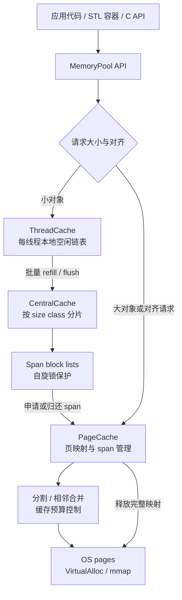

# my-MemoryPool

面向高频小对象分配的 C++17 内存池。推荐使用 `v3`：通过线程本地缓存、按 size class 分片的中央缓存和页缓存，减少通用分配器调用与多线程锁竞争，并提供 C++、STL 和 C ABI 接口。

## 性能数据

以下均为 Release 构建、统计和 Debug Guards 关闭、5 次运行中位数，单位为毫秒。结果依赖硬件、编译器和负载，仅用于参考。

### Windows / MSVC

| 场景 | v3 | new/delete | malloc/free |
|---|---:|---:|---:|
| 32B，100000 次 | 2.564 | 5.395 | 5.401 |
| 4 线程，每线程 25000 次 | 3.069 | 5.596 | 5.937 |
| 16B-2048B 混合，50000 次 | 4.700 | 13.978 | 15.357 |
| 4 线程跨线程释放，64B x 50000 | 2.129 | 2.587 | 2.313 |

扩展矩阵（节选）：

| 大小 / 线程 | v3 | new/delete | malloc/free |
|---|---:|---:|---:|
| 16B / 1 | 0.400 | 1.101 | 1.012 |
| 32B / 8 | 0.777 | 2.512 | 2.578 |
| 256B / 8 | 0.744 | 3.502 | 3.313 |
| 1KB / 8 | 0.813 | 5.188 | 4.396 |
| 4KB / 8 | 1.149 | 5.959 | 4.696 |
| 64KB / 8 | 84.162 | 638.919 | 639.161 |

### Linux / Ubuntu 22.04 / GCC

这是已完成的真实 runner 测量记录，不是当前自动 CI 结果（Linux 自动测试工作流已删除）。

| 场景 | v3 | new/delete | malloc/free |
|---|---:|---:|---:|
| 32B，100000 次 | 2.683 | 4.120 | 4.013 |
| 4 线程，每线程 25000 次 | 3.977 | 4.032 | 2.374 |
| 16B-2048B 混合，50000 次 | 2.832 | 8.398 | 7.876 |
| 4 线程跨线程释放，64B x 50000 | 1.751 | 1.405 | 1.199 |

扩展矩阵（节选）：

| 大小 / 线程 | v3 | new/delete | malloc/free |
|---|---:|---:|---:|
| 16B / 1 | 0.325 | 0.624 | 0.516 |
| 16B / 8 | 1.423 | 3.063 | 2.216 |
| 32B / 8 | 1.665 | 2.979 | 2.107 |
| 256B / 8 | 1.717 | 3.689 | 3.910 |
| 1KB / 8 | 1.507 | 5.392 | 4.477 |
| 4KB / 8 | 1.988 | 4.421 | 3.796 |
| 64KB / 8 | 36.307 | 172.518 | 174.898 |

Linux 测试期间 `reservedBytes=67534848`、`cachedPageBytes=65175552`，页缓存上限为 64 MiB。Linux 的 4 线程和跨线程释放仍可能落后于 glibc，不能宣称所有平台、所有负载都领先。

## 项目架构

```text
my-MemoryPool/
├── v1/                         教学版：固定大小池
├── v2/                         三层缓存早期实现
├── v3/                         推荐 SDK
│   ├── include/kama/           公共 C++、STL、C API 头文件
│   ├── src/                    ThreadCache/CentralCache/PageCache
│   ├── tests/                  单元、基准和压力测试
│   ├── examples/               最小接入示例
│   ├── cmake/                  CMake package 配置
└── README.md
```

### v3 架构示意图



```text
应用 / STL / C API
        │
ThreadCache（每线程无锁空闲链表）
        │ 批量 refill / flush
CentralCache（按 size class 分片、自旋锁）
        │ span 分配与归还
PageCache（页映射、分割、合并、缓存预算）
        │
OS：Windows VirtualAlloc / Linux mmap
```

v3 还提供预计算 size-class 索引、sized-free 快路径、跨线程无 size 释放、span 合并归还 OS、溢出和非法对齐检查，以及可选 Debug Guards、统计和 Sanitizer 支持。

## 构建与测试

```bash
cmake -S v3 -B v3/build-release -DCMAKE_BUILD_TYPE=Release \
  -DKAMA_MEMORY_POOL_BUILD_TESTS=ON -DKAMA_MEMORY_POOL_BUILD_EXAMPLES=ON \
  -DKAMA_MEMORY_POOL_ENABLE_STATS=OFF -DKAMA_MEMORY_POOL_ENABLE_DEBUG_GUARDS=OFF
cmake --build v3/build-release --parallel
cmake --build v3/build-release --target run_unit_tests
cmake --build v3/build-release --target perf
ctest --test-dir v3/build-release --output-on-failure
```

性能测试覆盖 16/32/64/256/1024/4096/65536B、1/2/4/8 线程、混合尺寸、实际内存写入和跨线程所有权转移，并对比 `new/delete` 与 `malloc/free`。Linux 可手动使用 `v3/Dockerfile.linux_perf` 复现实验环境；该 Docker 文件不是自动 CI。所有已测数据均集中维护在本 README，不再依赖额外的原始记录文件。

## 使用示例

```cpp
#include <kama/MemoryPool.h>
using Kama_memoryPool::MemoryPool;

void demo() {
    void* p = MemoryPool::allocate(64);
    MemoryPool::deallocate(p);
    void* q = MemoryPool::allocate(128);
    MemoryPool::deallocate(q, 128); // 已知大小时更快
    int* value = MemoryPool::newElement<int>(42);
    MemoryPool::deleteElement(value);
}
```

STL：`std::vector<int, Kama_memoryPool::Allocator<int>> values;`

C API：`kama_alloc(64)`、`kama_free(ptr)`、`kama_alloc_aligned(size, alignment)`、`kama_free_sized(ptr, size)`。

## 注意事项

- 池分配的指针必须使用本项目接口释放，不得与 `free`、`delete` 混用。
- 超过小对象上限的请求按页向 OS 申请；失败返回 `nullptr`，STL 分配器抛出 `std::bad_alloc`。
- 生产环境建议关闭统计、Debug Guards 和 Sanitizer；开发和 CI 中开启以发现误用。
- 发布前应在目标平台使用 ASan、UBSan、TSan 和长时间随机压力测试，不能仅凭一次基准断言无泄漏或绝对领先。

## 许可证

本项目当前用于学习与研究，正式商用前请结合自身合规要求进行审查。
